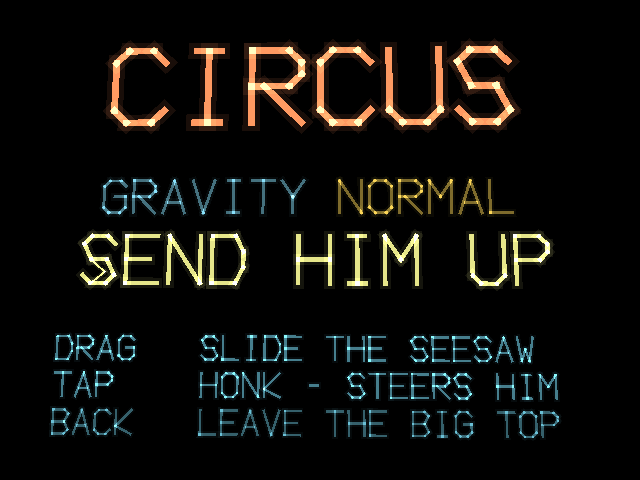
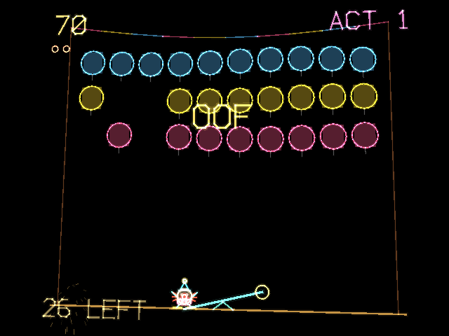

# x3circus

x3circus is a comic take on the 1977 arcade game Circus for the RayNeo X3 Pro AR glasses: a clown falls from a trapeze, you slide a seesaw underneath him, and a good catch flings the clown standing on the other end up into rows of balloons. Where the original punished the smallest miscalculation, this version widens the seesaw, gives the tap-to-honk gesture a steering effect on the airborne clown, and ramps difficulty through gravity alone, keeping the loop forgiving and funny rather than punishing. The whole soundtrack and every sound effect — the honk, the boing, the balloon pop, the clown's scream — are synthesized in-code rather than sourced, including a formant-synthesized voice built from scratch to sidestep licensing restrictions on off-the-shelf text-to-speech.

## Screenshots

  
  

## Controls

- Drag to slide the seesaw
- Tap to honk, which also nudges the airborne clown toward the seesaw
- Back to leave the big top

## Download

[X3Circus.apk](X3Circus.apk)
